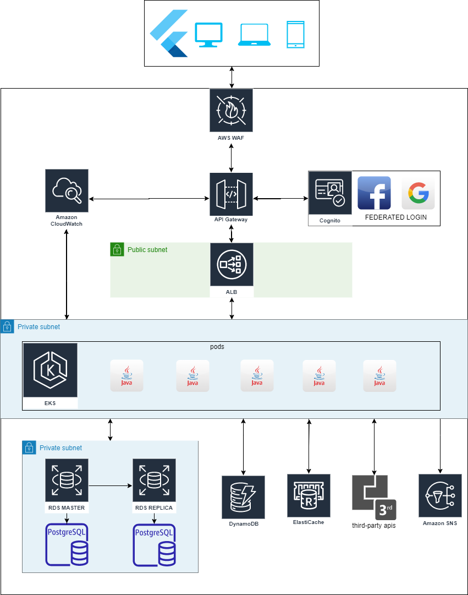

# 
BUILDERS CHALLENGE

- DRAW IO FILE: [LINK](builders.drawio)
# 

   

# 
PROCESSO CRIATIVO

1. para a parte web (cliente) foi escolhido usar flutter por ser um framework facilitador para desenvolver diversas aplicações tais como: mobile, web e desktop.
Escolhi flutter pelo fato de que quando compilado, o aplicativo torna-se nativo aumentando assim seu desempenho para acessar os dispositivos diretamente.

2. Na parte de login escolhi usar Cognito com federated de redes sociais para o cadastro e login na plataforma de e-commerce ser o mais simples possível.

3. escolhi usar Api Gateway para expor minhas apis com WAF para ajudar na parte de segurança das mesmas e assim deixar a parte front-end desacoplada e independente do back-end.

4. escolhi usar alb (application load balance) para que seja feita a distribuíção da tráfego de requisições para o pods da melhor maneira.

5. CloudWatch para log e observability tanto da aplicação como do Api Gateway para resolução de problemas que venham acontecer.

6. Escolhi usar EKS e não Lambda para melhor desempenho, menor custo, disponibilidade e escalabilidade da solução em datas que precisem de maior poder, tipo natal e black friday.

7. JAVA pela sua robustez e performance, mas poderia ter usado NODEJS, PYTHON ou GOLANG.

8. Na parte de banco de dados estou utilizando RDS com postgres pelo mesmo motivo de escalabilidade e redimensionamento de banco de dados. Estou utilizando replica em multi a-z para backup e possíveis problemas de disaster recovery.

9. Dynamodb para fazer lock das compras evitando assim duplicação e idempotência de pedidos.

10. ElastiCache para fazer gerenciamento de dados do cliente logado para evitar ficar buscando informações em vários lugares todo tempo.

11. Third-party apis para pagamentos com cartão, pix, boleto, cep, maps... 

12. SNS para disparos de e-mails e sms para clientes com dados de compras tais quais notas fiscais, rastreio de encomendas etc.
